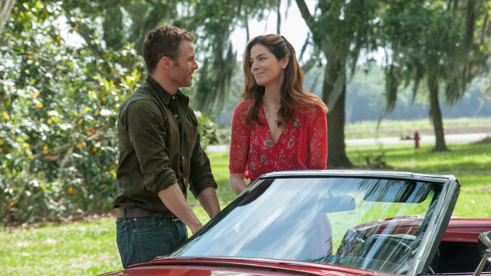
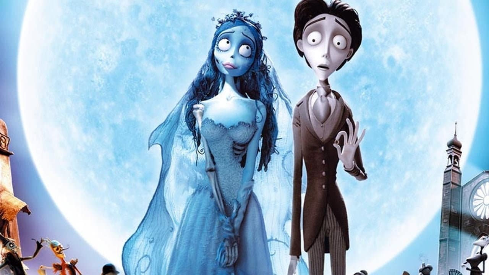
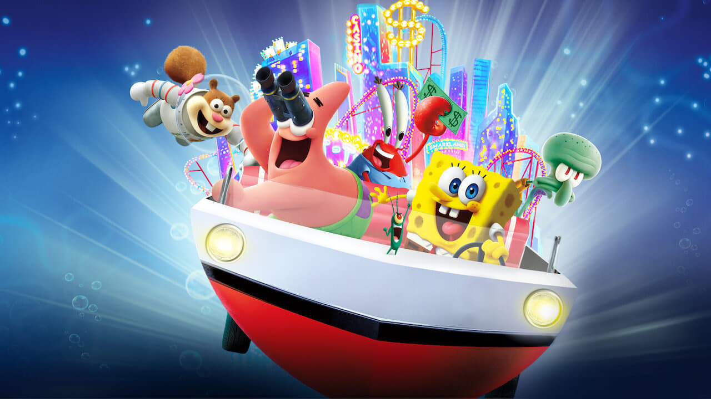
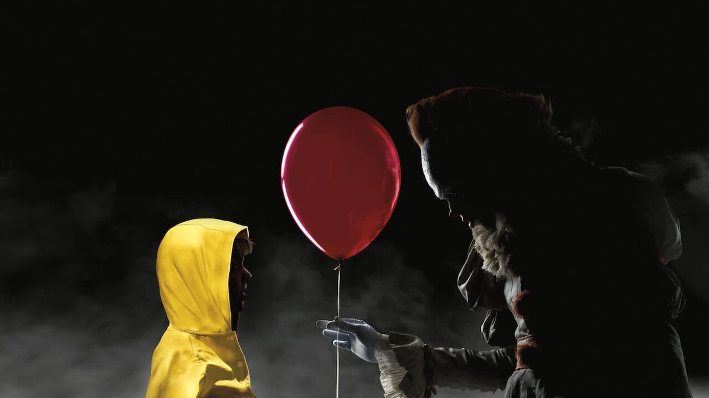

<!DOCTYPE html>
<html lang="en">
<head>
	<meta charset="UTF-8">
	<meta name="viewport" content="width=device-width, initial-scale=1.0">
	<link rel="stylesheet" href="css/estilos.css">
	<link href="https://fonts.googleapis.com/css2?family=Bebas+Neue&family=Open+Sans:wght@400;600&display=swap" rel="stylesheet"> 
	<title>Netflix</title>
</head>
<body>
	<header>
		

			<h2 class="logotipo">Netflix</h2>
			<nav>
				<a href="#" class="activo">Inicio</a>
				<a href="#">Programas</a>
				<a href="#">Películas</a>
				<a href="#">Películas Populares</a>
				<a href="#">Mi lista</a>
			</nav>
		

	</header>

	<main>
		

			

				<h3 class="titulo">Saw X</h3>
				

					Entre los acontecimientos de 'Saw' y 'Saw II', un enfermo y desesperado John Kramer viaja a México para someterse a un procedimiento médico arriesgado y experimental con la esperanza de encontrar una cura milagrosa para su cáncer, sólo para descubrir que toda la operación es una estafa para defraudar. 
				

				<button role="button" class="boton"><i class="fa-solid fa-play"></i>Reproducir</button>
				<button role="button" class="boton"><i class="fa-solid fa-circle-info"></i>Más info.</button>
			
			

		

		

			

				<h3>Películas Populares</h3>
				

			

			

				<button role="button" id="flecha-izquierda" class="flecha-izquierda"><i class="fa-solid fa-angle-left"></i></button>
				
				

					

						

							
						

						

							
						

						

							
						

						

							
						

						

							
						

						

							
						

						

							
						

						

							
						

						

							
						

						

							
						

						

							
						

						

							
						

						

							
						

						

							
						

						

							
						

						

							
						

					

				

				<button role="button" id="flecha-derecha" class="flecha-derecha"><i class="fa-solid fa-angle-right"></i></button>
			

		

	</main>

	
	
</body>
</html>

